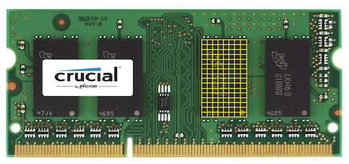

## 메모리

C에는 여러 자료형이 있고, 각 자료형은 서로 다른 크기의 메모리를 차지한다.

- bool: 불리언, 1바이트
- char: 문자, 1바이트
- int: 정수, 4바이트
- float: 실수, 4바이트
- long: (더 큰) 정수, 8바이트
- double: (더 큰) 실수, 8바이트
- string: 문자열, ?바이트

컴퓨터 안에는 RAM이라는 물리적 칩이 메모리 역할을 한다.

아래 이미지의 노란색 사각형들이 메모리다. 작은 사각형 하나가 1바이트를 의미한다.



만약 char 타입의 변수를 하나 생성하고, 값을 입력한다면

```c
int main(void) {
	char c1 = 'H';
	char c2 = 'I';
}
```

메모리 상에서는

|H(c1)|I(c2)|

이런 식으로 메모리의 작은 칸에 데이터를 저장한다. (실제로는 2진수로 변환된 데이터를 저장한다.)

<br/><br/>

## 배열

배열은 같은 자료형의 데이터를 메모리상에 연이어서 저장하고, 이를 하나의 변수로 관리하기 위해 사용된다.

아래처럼 배열을 선언할 수 있다.

```c
int array[10];
```

<br/><br/>

## 문자열

문자열도 char 자료형의 배열이다.

문자열의 끝에는 \0(널 종단 문자)가 온다. 문자열에 널 종단 문자가 필요한 이유는 문자열의 크기는 고정적이지 않기 때문에, 널 종단 문자로 문자열의 끝을 알려주기 위함이다.

(예를 들어 int형이었다면, 메모리 상의 4바이트만 보면 되지만, 문자열은 그렇지 않다. 문자열의 길이는 아주 짧을 수도, 아주 길 수도 있다. \0이 없으면 끝을 몰라, 프로그램이 필요 이상으로 일을 수행할 수도 있다.)

<br/><br/>

## 문자열의 활용

문자열의 각 문자는 ASCII 값으로 되어있다. 이를 이용해 대소문자 변환도 가능하다. 대문자 'A'와 소문자 'a'의 ASCII 값은 32씩 차이가 난다. 소문자에서 32를 빼면 대문자, 대문자에서 32를 더하면 소문자가 된다.

C언어의 표준 라이브러리, ctype.h에서도 관련 함수를 제공하고 있다. ctype에는 문자들이 조건에 맞는지 검사하거나 변환해주는 함수들이 있다.

string.h 역시 표준 라이브러리이며, 문자열 관련 라이브러리다. 문자열의 길이를 구하는 strlen 함수, 문자열을 비교하는 strcmp 함수 등이 있다.

<br/><br/>

## 명령행 인자

C언어에서 사용하는 main 함수는 다음과 같이 두 개의 인자를 받을 수 있다.

```c
#include <stdio.h>

int main(int argc, string argv[]) {
	...
}
```

- argv: 인자들의 배열
- argc: 인자 개수

프로그램을 터미널의 명령행에서 실행할 때, 함께 입력되는 값들을 인자로 받는다.

argv[0]은 기본적으로 프로그램의 이름이 저장된다.

만약 "./argc Test"를 실행했을 때, argc는 2, argv[1]은 "Test"가 된다.

명령행 인자를 이용해 clang이나 make 같은 기능을 구현할 수도 있다.

혹은, 이전엔 scanf를 사용해 프로그램을 실행해야 입력값을 받을 수 있었다면,  명령행 인자로 프로그램을 실행하면서 바로 입력값을 받아 코드 라인 수를 줄일 수도 있다.

<br/><br/><br/><br/>

## 느낀점

명령행 인자 부분이 특히 기억에 남는다. 예전에 main 함수의 인자값이 뭔지 궁금해서 찾아봤지만 사실 정확하게 이해가 잘 안 됐기 때문이다. 이번 기회로 정리하고 갈 수 있어 만족스럽다.

이미 아는 내용들도 많았는데, 정리하는데 시간을 많이 썼다. 어떤 내용을 타이핑 해서 정리하는 것도 쉽지 않은 일인 것 같다. 그래도 이렇게 쓰면 정리도 되고, 나중에 까먹은 내용을 찾을 때도 편할 걸 생각하며 열심히 하려고 한다.

<br/><br/>

## 출처

부스트코스 CS50 [www.boostcourse.org/cs112](http://www.boostcourse.org/cs112)
