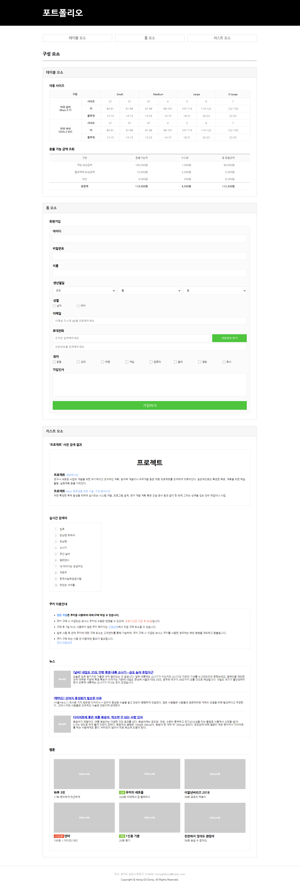

# Project A-2

## 결과 이미지

 

## 느낀점

- HTML 구조를 짤 때 좀 더 시멘틱하게 짜기 위한 고민하는 경험을 해볼 수 있어 좋았다.

- IE10 브라우저까지 지원해야 해서 크로스 브라우징 문제에 대해, 특히 flex 관련 버그들을 찾아볼 기회가 되었다.

- 코드 리뷰를 통해 무심코 놓친 부분도 챙길 수 있었고, 질문에 대한 답도 들을 수 있어 좋았다.

(img를 a 태그로 감쌌는데 img 하단에 알 수 없는 여백이 생겼다.

-> img는 인라인 요소로 여백이 생길 수 있다. vertical-align:top이나 display:block으로 해결할 수 있다.
혹은 부모 요소에 height 값을 주어 height를 고정시켜 해결할 수도 있다.)
